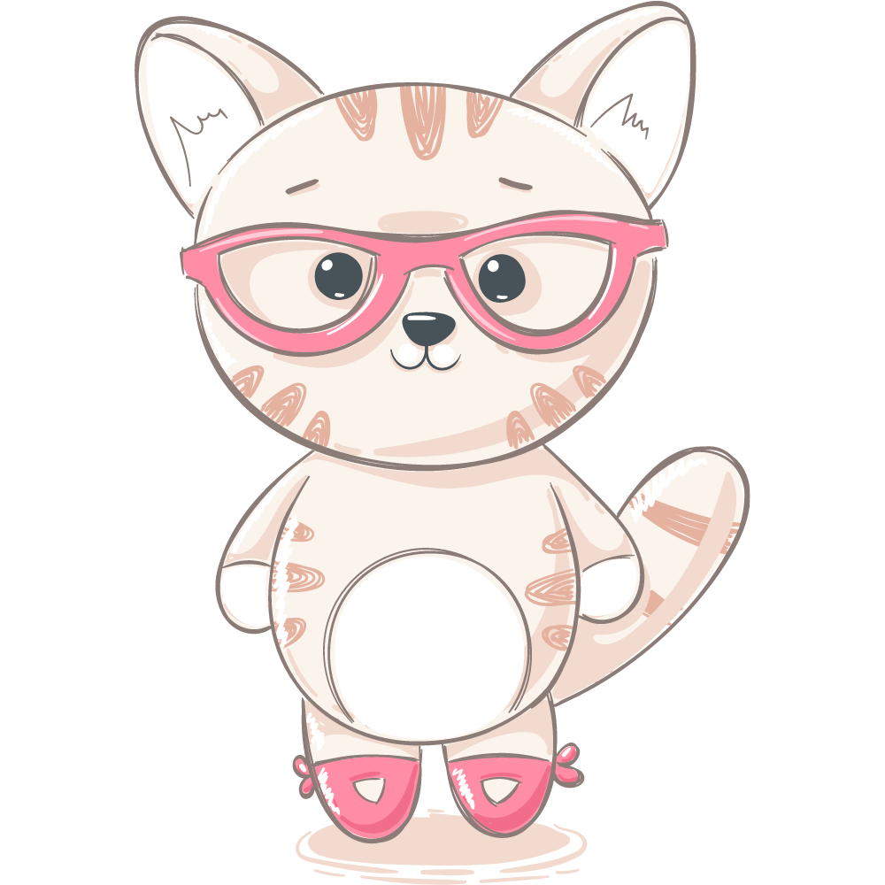

# Initial Requirements for MVP

- The idea is based off of [Cookie Clicker](https://orteil.dashnet.org/cookieclicker/)
- You have an in-browser cat.
- The goal is to keep the cat happy, which can be tracker through a 'purr counter' (a positive integer).
- Update the number of purrs (happiness) and show on screen for every click.

## Points and Levels

*Item cost doubles with each one purchased*

- Level 0 - Start
  - Food, Cost: 15 purrs, Resting Purrs: .5/second
  - Mice, Cost: 25 purrs, Resting Purrs: 1/second
- Level 1 - 10,000 purrs
  - Scratching Pad, Cost: 50 purrs, Resting Purrs: 2/second
  - Wool Ball, Cost: 75 purrs, Resting Purrs: 4/second
- Level 2 - 100,000 purrs
  - Wand Toys, Cost: 150 purrs, Resting Purrs: 8/second
  - Cat Nip, Cost: 200 purrs, Resting Purrs: 10/second
- Level 3 - 1,000,000 purrs
  - Cat Tower, Cost: 400 purrs, Resting Purrs: 15/second
  - Auto Feeder, Cost: 500 purrs, Resting Purrs: 20/second

## MVP Requirements

- Users can click on the cat image to gain purrs.
- Welcome screen is shown to users where they can choose their cat picture and name.

## Version 1 Requirements

- A timer must be running in the background.
- Items will become available for purchase if you have enough purrs and the required level.
- The first item is automatically available from 0 seconds.
- Users can level up after they have accrued a certain number of purrs (total, not subtracting what they spend on items).

## Version 2 Requirements

- Add store pages from mockups.
- Implement happiness multiplier; you can get over time and with certain items. This makes purrs accrue more quickly.
- Users can choose a color or theme (optional) for cat and app.
